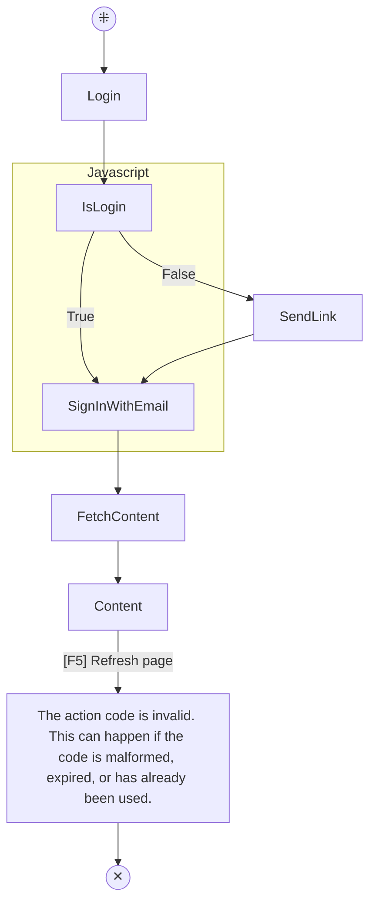

# State Machine

```mermaid
graph TD

init(("⁜"))
login[Login]
fetchContent[FetchContent]
content[Content]
sendLink[SendLink]
error[The action code is invalid. This can happen if the code is malformed, expired, or has already been used.]
dead(("✕"))


init --> login
login --> isLogin
isLogin -- False --> sendLink
isLogin -- True --> signInWithEmail
sendLink --> signInWithEmail
signInWithEmail --> fetchContent
fetchContent --> content
content -- "[F5] Refresh page" --> error
error --> dead


subgraph Javascript
isLogin[IsLogin]
signInWithEmail[SignInWithEmail]
end

```